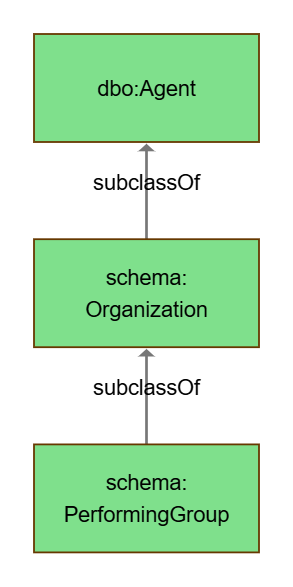

In the Artsdata data model, [`schema:Organization`](https://schema.org/Organization) is also a subclass of [`dbo:Agent`](http://dbpedia.org/ontology/Agent).

[[open drawing tool](https://www.yworks.com/yed-live/?file=https://gist.githubusercontent.com/fjjulien/26dfe0c7f79913087873cdaf69a989dc/raw/b923db08305bf342c0e5da56e1e8263536c8704b/artsdata-organization-class-hierarchy)]

## Organization Types

[Artsdata Organization Types](https://docs.artsdata.ca/organization-types.html) is a controlled vocabulary for organization types used in Artsdata. In this vocabulary, the parent concept [`adr:Organization`](http://kg.artsdata.ca/resource/Organization) is defined as "A structured group of people, united by a common purpose". The goal of this controlled vocabulary is to serve as a base for mapping different types of arts organizations.

In addition to concepts from the Artsdata Organization Types controlled vocabulary, Artsdata accepts Schema.org Organization sub-types as well as Wikidata concepts.

## Adding organizations to Artsdata.ca

### Structured data template
* [Arts Organization Structured Data Template](https://docs.google.com/document/d/1e_2pVYaGYkVxKtl6Y6btrHYrIyqoNf_6yeSl4dRJLbI/edit?tab=t.0#heading=h.fn96d7fxizbh)

## Minimal requirements for minting or linking Artsdata IDs for organizations

The following properties are required by the Artsdata SHACL validator when minting or linking an Artsdata ID for an organization.

* [name](https://schema.org/name) - Indicate language @en, @fr
* [url](https://schema.org/url) - Official URL of the organization

### Recommended
* [additionalType](https://schema.org/additionalType) - Please use the [Artsdata Organization Type](http://kg.artsdata.ca/ontology/ArtsdataOrganizationTypes) controlled vocabulary
* [address](https://schema.org/address) - Use [PostalAddress](https://schema.org/PostalAddress)
* [sameAs](https://schema.org/sameAs) - Please use an Artsdata ID obtained from the Artsdata Reconciliation Service API, and optionally other social media profiles and external global IDs like Wikidata and ISNI.
* [alternateName](https://schema.org/alternateName) - Name typically found on websites. Indicate language @en, @fr

* [legalName](http://schema.org/legalName) (pending) - indicate language @en, @fr
* [contactPoint](http://schema.org/contactPoint) (pending)
* [subOrganization](http://schema.org/subOrganization) (pending)
* [parentOrganization](http://schema.org/parentOrganization) (pending)
* [identifier](http://schema.org/identifier) - Established identifiers like the Canadian Business Number. For example: ({ "@type": "PropertyValue", "propertyID": "BN", "value":  "801228875"})

### Mapping to Wikidata
Social media URLs in schema:sameAs and identifiers are automatically mapped to Wikidata properties.
* Facebook ID ([wdt:P2013](http://www.wikidata.org/entity/P2013))
* Twitter username ([wdt:P2002](http://www.wikidata.org/entity/P2002))
* Instagram username ([wdt:P2003](http://www.wikidata.org/entity/P2003))
* Canadian business number ([wdt:P8860](http://www.wikidata.org/entity/P8860))
* Numéro d'entreprise du Québec ([wdt:P10503](http://www.wikidata.org/entity/P10503))
