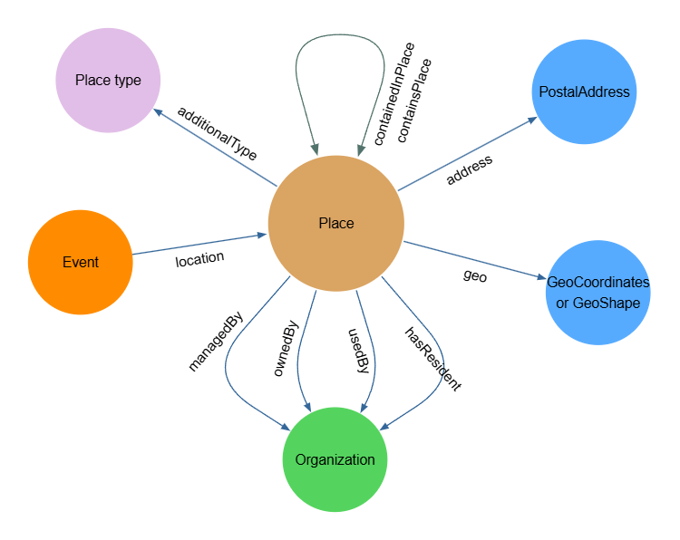

# Place

Artsdata importe la classe `Place` de Schema.org. Dans Schema.org, un [Place](https://schema.org/Place) est défini comme une « entité ayant une étendue physique relativement fixe ».

Dans Artsdata, la classe `Place` peut être utilisée pour décrire toute structure architecturale, par exemple un bâtiment ou une salle, ainsi que tout lieu extérieur.

Le profil d’application Artsdata pour la classe `Place` repose sur les principales propriétés de Schema.org et s’inspire du [WikiProjet Wikidata sur les lieux culturels](https://wikidata.org/wiki/Wikidata:WikiProject_Cultural_venues), maintenu par CAPACOA et la communauté LODEPA.

Le profil d’application tire notamment parti de la propriété schema:placeContainedIn afin de créer des liens entre les salles et les bâtiments, ainsi qu’entre les bâtiments et les lieux qui les englobent, comme une ville. Cela permet de situer automatiquement les lieux dans une ville, une région, une province et un pays. La création de liens facilite la réconciliation des lieux lorsque seuls un nom et une adresse postale sont disponibles.

Lorsqu’une entité de type Place provenant d’une source externe est réconciliée avec un identifiant créé par Artsdata, elle est reliée à son identifiant Artsdata au moyen de la propriété `schema:sameAs`.

Voici un aperçu des propriétés pour lesquelles la classe `Place` constitue le domaine ou la portée.



[Ouvrir l’outil de dessin](https://www.yworks.com/yed-live/?file=https://gist.githubusercontent.com/fjjulien/99c226a4bc505e27c5b2024dd68c2e7d/raw/eba8e87d844efa55467626154deff432e4949188/Artsdata_Place_application_profile)

## Types de lieux

Les entités de type Place peuvent être catégorisées au moyen de types supplémentaires provenant du [vocabulaire contrôlé des types de lieux d’Artsdata](https://docs.artsdata.ca/place-types.html), à l’aide de la propriété `schema:additionalType`.

Une page de documentation complète sur le vocabulaire contrôlé des types de lieux d’Artsdata est actuellement en cours d’élaboration. En attendant sa publication, vous pouvez consulter cette [version dans Google Sheets](https://docs.google.com/spreadsheets/d/1UtW5_tLdR72vf6WCZNPOmgJQ1SQGMc0xL8hRT3OAY9Y/edit?usp=sharing).

## Exigences minimales pour les entités de type Place

Pour qu’un nouvel identifiant Artsdata unique et pérenne puisse être créé, c’est-à-dire attribué, ou pour qu’une entité puisse être automatiquement reliée à un identifiant Artsdata existant, une entité de type `Place` doit posséder un [schema:name](https://schema.org/name) ainsi que des renseignements géographiques conformes. Voici les trois structures acceptées pour les renseignements géographiques.

**1. Un objet schema:PostalAddress complet, comprenant streetAddress, locality (ville), region (province ou territoire), postalCode et country**

```
 "address": {
    "type": "PostalAddress",
    "streetAddress":  "580 Rue Maclaren E",
    "addressLocality": "Gatineau",
    "addressRegion": "QC",
    "postalCode": "J8L 2W1",
    "addressCountry":"CA"
  }
```

OU

**2. schema:longitude + schema:latitude ET un objet schema:PostalAddress comprenant region (province ou territoire) et country**

```
  "latitude": "45.5873706",
  "longitude": "-75.400796",
  "address": {
    "type": "PostalAddress",
    "addressRegion": "QC",
    "addressCountry":"CA"
    }
```

```
 "geo": {
    "@type": "GeoCoordinates",
    "latitude": "40.75",
    "longitude": "-73.98"
  },
  "address": {
    "type": "PostalAddress",
    "addressRegion": "QC",
    "addressCountry":"CA"
  }
```

OU

**3. schema:geo avec un objet GeoShape ET un objet schema:PostalAddress comprenant region (province ou territoire) et country**

```
  "geo": {
    "@type": "GeoShape",
    ...l’une des propriétés suivantes : "box", "circle", "polygon"
  },
  "address": {
    "type": "PostalAddress",
    "addressRegion": "QC",
    "addressCountry":"CA"
  }
```

Remarques :

- Artsdata utilise `name` et `address.postalCode` pour réconcilier, c’est-à-dire « reconnaître », automatiquement ou manuellement les entités de type Place. Lorsqu’une fiche de lieu provenant d’une source externe possède exactement le même nom et le même code postal qu’un lieu dans le graphe principal d’Artsdata, et qu’aucun autre lieu d’Artsdata ne possède ce code postal, la fiche externe et l’entité Artsdata sont automatiquement reliées. Si au moins deux lieux du graphe principal d’Artsdata possèdent le même code postal qu’une fiche de lieu externe, les correspondances potentielles doivent être examinées avant qu’un responsable des données d’Artsdata puisse relier manuellement l’une d’entre elles.
- En l’absence de renseignements géographiques conformes, Artsdata peut tout de même être en mesure de réconcilier une entité de type Place si la fiche externe contient un lien `sameAs` vers un identifiant Artsdata ou Wikidata.
- Discussion connexe : [Mint/Link Parks and Other Places Without Postal Codes #343](https://github.com/culturecreates/artsdata-data-model/discussions/343)

## Propriétés de l’ontologie Artsdata

| Propriété | Portée | Statut | Description |
| --- | --- | --- | --- |
| [ado:managedBy](http://kg.artsdata.ca/ontology/managedBy) | schema:Organization | Facultative | Relie un lieu à l’organisme responsable de ses activités quotidiennes. |
| [ado:ownedBy](http://kg.artsdata.ca/ontology/ownedBy) | schema:Organization | Facultative | Relie un lieu à l’organisme qui en est propriétaire. |
| [ado:usedBy](http://kg.artsdata.ca/ontology/usedBy) | schema:Organization | Facultative | Relie un lieu à un organisme qui utilise régulièrement ce lieu pour y tenir des événements. Un seuil minimal de régularité doit être atteint pour que cette relation soit considérée comme vraie. En règle générale, si un organisme tient régulièrement des événements chaque année dans un lieu donné, on peut considérer qu’une relation usedBy est présente. |
| [ado:hasResident](http://kg.artsdata.ca/ontology/hasResident) | schema:Organization | Facultative | Relie un lieu à un organisme qui y possède un statut de résident, mais qui n’en assure pas la gestion. Les organismes résidents bénéficient d’un accès privilégié aux installations pour leurs activités de création, de production et de présentation. Des espaces de bureau peuvent également leur être fournis dans le lieu. |

## Propriétés Schema.org sélectionnées

| Propriété | Statut | Description |
| --- | --- | --- |
| [schema:name](https://schema.org/name) | Obligatoire | Le nom sous lequel le lieu est le plus couramment connu. Si vous décrivez une salle située dans un bâtiment, par exemple une salle de spectacle, utilisez le nom de cette salle plutôt que celui du bâtiment. Pour en savoir plus, consultez ces [lignes directrices](https://docs.artsdata.ca/location.html). |
| [schema:address](https://schema.org/address) | Obligatoire | L’adresse physique de l’élément. Dans le cas d’un bâtiment ou d’un espace intérieur situé dans un bâtiment, Artsdata exige un objet schema:PostalAddress complet comprenant streetAddress, locality (ville), region (province ou territoire), postalCode et country. Pour les espaces en plein air, Artsdata exige un objet schema:PostalAddress comprenant region (province ou territoire) et country. |
| [schema:additionalType](https://schema.org/additionalType) | Recommandée | Saisissez les types supplémentaires correspondant au type particulier de lieu. Consultez le [vocabulaire contrôlé d’Artsdata](http://kg.artsdata.ca/resource/ArtsdataPlaceTypes) afin de déterminer le ou les types de lieux les plus appropriés. |
| [schema:sameAs](https://schema.org/sameAs) | Recommandée | Saisissez les URI d’identifiants pérennes, par exemple un identifiant Artsdata ou Wikidata, qui identifient sans ambiguïté l’entité de type Place. Saisissez toujours les identifiants sous forme d’URI complète plutôt que de saisir uniquement l’identifiant. Pour en savoir plus, consultez ces [lignes directrices](https://docs.artsdata.ca/identifiers-guidelines/sameas.html). |
| [schema:alternateName](https://schema.org/alternateName) | Facultative | Un autre nom ou un alias du lieu. Pour en savoir plus, consultez ces [lignes directrices](https://docs.artsdata.ca/location.html). |
| [schema:disambiguatingDescription](https://schema.org/disambiguatingDescription) | Facultative | Une courte description de l’élément permettant de le distinguer d’autres éléments semblables. Si cette propriété est laissée vide, Artsdata génère une description de désambiguïsation fondée sur la localité de l’entité. |
| [schema:url](https://schema.org/url) | Facultative | Saisissez l’URL canonique, aussi appelée URL « officielle », de l’entité de type Place. |
| [schema:containedInPlace](https://schema.org/containedInPlace) | Facultative | La relation de base entre un lieu et le lieu qui le contient. Cette propriété permet notamment de définir la relation entre une salle de spectacle et le bâtiment qui la contient. Pour en savoir plus, consultez ces [lignes directrices](https://docs.artsdata.ca/location.html). |
| [schema:containsPlace](https://schema.org/containsPlace) | Facultative | La relation de base entre un lieu et un autre lieu qu’il contient. |
| [schema:geo](https://schema.org/geo) | Facultative | Cette propriété est privilégiée par rapport à l’ajout explicite de la longitude et de la latitude. En effet, la propriété [geo](https://schema.org/geo) peut non seulement comprendre la longitude et la latitude dans un objet [GeoCoordinates](http://schema.org/GeoCoordinates) imbriqué, mais elle peut également être définie au moyen d’un objet [GeoShape](https://schema.org/GeoShape). Cela offre davantage de souplesse pour décrire des parcs et des zones qui ne peuvent pas facilement être représentés par un seul point de coordonnées géographiques. |
| [schema:latitude](https://schema.org/latitude) | Facultative | La latitude d’un lieu. Artsdata recommande d’imbriquer la latitude et la longitude sous la propriété [geo](https://schema.org/geo). |
| [schema:longitude](https://schema.org/longitude) | Facultative | La longitude d’un lieu. Artsdata recommande d’imbriquer la latitude et la longitude sous la propriété [geo](https://schema.org/geo). |
| [schema:maximumAttendeeCapacity](https://schema.org/maximumAttendeeCapacity) | Facultative | La capacité maximale de la salle. Des systèmes comme scenepro.ca et Wikidata peuvent transmettre ces renseignements à Artsdata. Lorsque plusieurs configurations de salle sont possibles, seule la valeur maximale doit être sélectionnée. |
