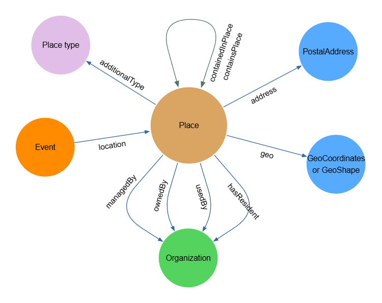

# Place

Artsdata imports the `Place` class from Schema.org. In Schema.org, a [Place](https://schema.org/Place) is defined as "Entities that have a somewhat fixed, physical extension."

In Artsdata, the `Place` class can be used to define any architectural structure (e.g. a building or a room) or outdoor location.

The Artsdata application profile for the `Place` class draws on core Schema.org properties and is inspired by the [Wikidata WikiProject Cultural venues](https://wikidata.org/wiki/Wikidata:WikiProject_Cultural_venues), maintained by CAPACOA and the LODEPA community. 

The application profile notably takes advantage of the schema:placeContainedIn to create links between rooms/halls and buildings, as well as between buildings and encompassing places such as city. This automatically situates Places in a city, region, province and country. Linking increases the ability for reconciling places when only a name and postal address is available.

Once a Place entity from an external source is reconciled with an Artsdata minted identifier, it is linked with its Artsdata identifier with the `schema:sameAs` property.

Here is an overview of properties that have the `Place` class as a domain or as a range.



[Open Drawing Tool](https://www.yworks.com/yed-live/?file=https://gist.githubusercontent.com/fjjulien/99c226a4bc505e27c5b2024dd68c2e7d/raw/eba8e87d844efa55467626154deff432e4949188/Artsdata_Place_application_profile)

## Types of Places 

Place entities can be categorized with additional types from the [Artsdata Place Types controlled vocabulary](https://docs.artsdata.ca/place-types.html) using the `schema:additionalType` property.

A full documentation page for the Artsdata Place Types controlled vocabulary is currently under development. Until this page is available, you may consult this [Google Sheet version](https://docs.google.com/spreadsheets/d/1UtW5_tLdR72vf6WCZNPOmgJQ1SQGMc0xL8hRT3OAY9Y/edit?usp=sharing).

## Minimal requirements for Place entities

To be minted (i.e. assigned) a new Artsdata unique persistent identifier or to be automatically linked to an existing Artsdata ID, a `Place` type entity must have a [schema:name](https://schema.org/name) and compliant geographic information. Here are the three accepted shapes for geographic information. 

**1. complete schema:PostalAddress object (including streetAddress, locality (city), region (province/territory), postalCode, country)**

```
 "address": {
    "type": "PostalAddress",
    "streetAddress":  "580 Rue Maclaren E",
    "addressLocality": "Gatineau",
    "addressRegion": "QC",
    "postalCode": "J8L 2W1",
    "addressCountry":"CA"
  }
```

OR

**2. schema:longitude + schema:latitude AND schema:PostalAddress object with region (province/territory) and country**

```
  "latitude": "45.5873706",
  "longitude": "-75.400796",
  "address": {
    "type": "PostalAddress",
    "addressRegion": "QC",
    "addressCountry":"CA"
    }
```
```
 "geo": {
    "@type": "GeoCoordinates",
    "latitude": "40.75",
    "longitude": "-73.98"
  },
  "address": {
    "type": "PostalAddress",
    "addressRegion": "QC",
    "addressCountry":"CA"
  }
```

OR

**3. schema:geo with a GeoShape object AND schema:PostalAddress object with region (province/territory) and country**

```
  "geo": {
    "@type": "GeoShape",
    ...one of the following properties: "box", "circle", "polygon"
  },
  "address": {
    "type": "PostalAddress",
    "addressRegion": "QC",
    "addressCountry":"CA"
  }
```

Related discussion: [Mint/Link Parks and Other Places Without Postal Codes #343](https://github.com/culturecreates/artsdata-data-model/discussions/343)

## Properties in the Artsdata Ontology

| Property | Range | Status | Description |
| --- | --- | --- |  --- |
| [ado:managedBy](http://kg.artsdata.ca/ontology/managedBy) | schema:Organization | Optional | Links a Place to the Organization responsible for its day-to-day operations. |
| [ado:ownedBy](http://kg.artsdata.ca/ontology/ownedBy) | schema:Organization | Optional | Links a Place to an Organization that owns it. |
| [ado:usedBy](http://kg.artsdata.ca/ontology/usedBy) | schema:Organization | Optional | Links a Place to an Organization that regularly uses this Place as an Event location. A minimum threshold of regularity should be met for this relationship to be true. As a rule of thumb, if an organization regularly holds events every year in a given place, one could deem a usedBy relationship to be present. |
| [ado:hasResident](http://kg.artsdata.ca/ontology/hasResident) | schema:Organization | Optional | Links a Place to an Organization that has a residency status within this Place but does not manage the venue. Resident companies have privileged access to the facilities for creation, production and presentation activities. They may also be provided office space within the venue. |

## Selected Schema.org properties

| Property | Status | Description |
| --- | --- | --- |
| [schema:name](https://schema.org/name) | Required | The name by which the Place is most commonly known. If describing a room within a building (e.g. a performance hall), use the name of that room rather than the name of the building. For more information, see these [guidelines](https://docs.artsdata.ca/location.html). |
| [schema:address](https://schema.org/address) | Required | The physical address of the item. In the case of a building or an interior space within a building, Artsdata requires a full complete schema:PostalAddress object (including streetAddress, locality (city), region (province/territory), postalCode, country). For open-air spaces, Artstdata requires schema:PostalAddress object with region (province/territory) and country  |
| [schema:additionalType](https://schema.org/additionalType) | Recommended | Enter additional types corresponding to the particular type of place. Refer to the [Artsdata controlled vocabulary](http://kg.artsdata.ca/resource/ArtsdataPlaceTypes) to identify the most appropriate event type(s). |
| [schema:sameAs](https://schema.org/sameAs) | Recommended | Enter the URIs of persistent identifiers (ex. Artsdata or Wikidata ID) that unambiguously identify the place entity. Always enter identifiers in full URI format (instead of entering just the ID itself). For more information, see these [guidelines](https://docs.artsdata.ca/identifiers-guidelines/sameas.html). |
| [schema:alternateName](https://schema.org/alternateName) | Optional | An alias for the place. For more information, see these [guidelines](https://docs.artsdata.ca/location.html). |
| [schema:disambiguatingDescription](https://schema.org/disambiguatingDescription) | Optional | A short description of the item used to disambiguate from other, similar items. If left empty, Artsdata generates a disambiguating description based on the locality of the entity. |
| [schema:url](https://schema.org/url) | Optional | 	Enter the canonical (aka “official”) URL of the place entity. |
| [schema:geo](https://schema.org/geo) | Optional | This property is favoured over adding explicit longitude and latitude because the property [geo](https://schema.org/geo) can not only include longitude and latitude in a nested [GeoCoordinates](http://schema.org/GeoCoordinates), but it can also be defined by a [GeoShape](https://schema.org/GeoShape) object which gives flexibility to define parks and areas that cannot easily be definedd by a single geo coordinates node. |
| [schema:containedInPlace](https://schema.org/containedInPlace) | Optional | The basic containment relation between a place and one that contains it. This property is useful to define the relationship between a performance hall and the building that contains it. For more information, see these [guidelines](https://docs.artsdata.ca/location.html). |
| [schema:containsPlace](https://schema.org/containsPlace) | Optional | The basic containment relation between a place and another that it contains. |
| [schema:latitude](https://schema.org/latitude) | Optional | The latitude of a location. Artsdata recommends nesting latitude and longitude under the [geo](https://schema.org/geo) property. |
| [schema:longitude](https://schema.org/longitude) | Optional | The latitude of a location. Artsdata recommends nesting latitude and longitude under the [geo](https://schema.org/geo) property. |
| [schema:maximumAttendeeCapacity](https://schema.org/maximumAttendeeCapacity) | Optional | Maximum room capacity. Systems like scenepro.ca and Wikidata can feed this information to Artsdata. When multiple room configurations are available, only the maximum value should be selected. | 
