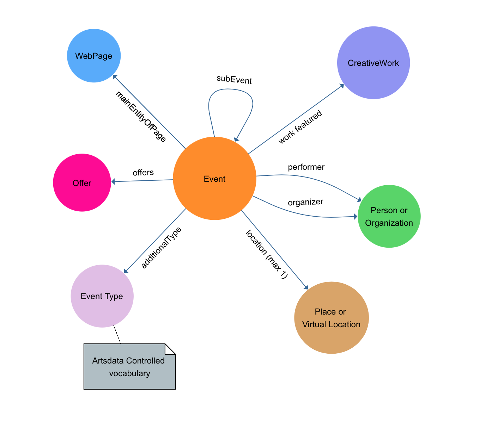





## Artsdata Data Model v{{ site.data.versions.schemaVersion }}
[Edit page](https://github.com/culturecreates/artsdata-data-model/blob/master/{{page.path}}) | 

A data model for representing performing arts events and works, as well as related places, people and organizations. 

The Artsdata data model (ontology) is a sub-set of Schema.org and other ontologies, along with core concepts and controlled vocabularies specific to Artsdata. The data model is formally represented using the language SHACL [here](https://kg.artsdata.ca/query/show?sparql=https://raw.githubusercontent.com/artsdata-stewards/artsdata-actions/main/queries/artsdata_SHACL_validation_rules.sparql).

The classes and properties used in Artsdata resemble [Google Event Structured Data](https://developers.google.com/search/docs/data-types/event).  The main difference is that Artsdata creates links between entities within Artsdata and entities outside of Artsdata including links to Wikidata and other LOD (Linked Open Data) sources.  Artsdata also generates persistent global identifiers (IRIs also called URIs) for classes such as Events, Live Performance Works, Places, Persons and Organizations.

Here are the main Classes used in Artsdata.

[[open drawing tool](https://www.yworks.com/yed-live/?file=https://gist.githubusercontent.com/saumier/678866c150bdf24519892d68d640a904/raw/f1249bb614c7a659e683360cbbee2547c9d8f62b/artsdata_event_model)]

### Classes

<ol>

  
<li>
    <a href="{{ base }}{{ class.url }}">
        {{ class.class_name }}
    </a>
</li>
  

</ol>

### Controlled vocabularies

- [Event types]({{ base }}/event-types.html)
  
- [Organization types]({{ base }}/organization-types.html)

- [Genres]({{ base }}/genres.html)

### Persistent Identifiers

In addition to Artsdata Identifiers, the Artsdata Knowledge Graph relies on other unique persistent identifiers, like Wikidata and ISNI, to recognize and reconcile entities of type [Organization]({{ base }}/classes/organization.html), [Person]({{ base }}/classes/person.html) and [Place]({{ base }}/classes/place.html). 

[Guidelines regarding persistent identifiers for data providers]({{ base }}/identifiers-guidelines/identifier-recommendations.html)

### Structured Data Templates

- [Event templates]({{ base }}/gabarits-jsonld/README.html)

- [Person templates](https://docs.google.com/document/d/e/2PACX-1vRdOlvKHAEP-4MEUyt3Y4BhyfGn8Ki4Nu40vw_JlaCYDZ1hEHnloH-qGyBcrjXXBbjCz1InKYz3lKw2/pub)

- [Organization templates]({{ base }}/gabarits-jsonld/organization) 

### SHACL Validation Reports

[SHACL]({{ base }}/shacl_reports.html) shapes are used to validate data before importing.

### Ontologies & Inferencing

Artsdata.ca uses a basic set of RDFS and OWL entailments (or ruleset) to enable simple inferencing, called **OWL-Horst (optimized)**. 

The main ontology used in Artsdata.ca is **Schema.org**. Artsdata.ca imports the core Schema.org schema and the pending Schema.org schema (to include schema:EventSeries which is a pending class). Other ontologies imported or used in Artsdata include DBpedia, DCAT, DATAID, PROV, SHACL, VANN, VoID, SKOS, and Wikidata.

Artsdata.ca has a large number of class and property mappings between Schema.org, Wikidata.org, DBpedia.org, LRMoo, CIDOC-CRM, FRBRoo, AAT, FOAF and DOLCE+DnS Ultralite (Ontology Design Patterns) using owl:equivalentClass, owl:equivalentProperty, skos:exactMatch, and skos:closeMatch. Some mappings come prebuilt from external ontologies; others are defined within Artsdata. 

#### Exceptions handling schema.org in Artsdata
Artsdata converts all schema.org **https** URIs to **http** URIs, and also makes the following transformations:
1. schema:eventStatus and schema:eventAttendanceMode are converted to URIs in Artsdata, whereas the schema.org @context defines them as Literals.
1. datatype schema:Date and schema:DateTime are converted to xsd:date or xsd:dateTime to enable SPARQL to handle time.
1. schema:LocalBusiness and it's subClasses are replaced with schema:Place to ensure that schema:Organization and schema:Place are disjoint (meaning a Place cannot be an Organization and vice versa).
 
#### Ontologies loaded into Artsdata
* [https://www.w3.org/2000/01/rdf-schema](https://www.w3.org/2000/01/rdf-schema)
* [External ontologies](https://github.com/culturecreates/artsdata-data-model/tree/master/_triples)
* [Artsdata controlled vocabularies](https://github.com/culturecreates/artsdata-data-model/tree/master/ontology)
    * [http://kg.artsdata.ca/resource/ArtsdataEventTypes](http://kg.artsdata.ca/resource/ArtsdataEventTypes)
    * [http://kg.artsdata.ca/resource/ArtsdataOrganizationTypes](http://kg.artsdata.ca/resource/ArtsdataOrganizationTypes)
    * [http://kg.artsdata.ca/resource/ArtsdataGenres](http://kg.artsdata.ca/resource/ArtsdataGenres)

### Provenance

Data is great, but it is not the ultimate truth, and without traceability it can lose our trust. For example, what if two web pages have different dates for the same performing arts event. Which source is more trust worthy? How can we follow the data back to the source to decide for ourselves? 

Artsdata.ca tracks data provenance in 2 different ways:
1. Data feed metadata attached to named graphs. Each data feed source in Artsdata.ca is stored in a separate named graph. The graph's URI is used as the subject of the provenance metadata.  This technique to track provenance is generally called the **Named Graphs** approach.  Each named graph URI is a prov:Entity and is linked to provenance metadata including the date when the data feed was loaded, the software used to collect it and the email of the contributing organization. Each time a data feed is imported, whether by crawling a web site, using an JSON API or loading a spreadsheet, the graph's provenance metadata is updated. 
2. Core data annotations with RDF-star. Core data in Artsdata for all minted entities have provenance tracked using RDF-star and the Provenance Ontology (using prov:wasDerivedFrom and for:wasGeneratedBy). 

### Data Flow Architecture

In principle, anyone can add data to Artsdata.ca as long as certain data requirements are met.  Here is a [diagram]({{ base }}/architecture/overview.html) about how data flows in and out of Artsdata.ca.

### Caching LOD

Artsdata.ca loads LOD from Wikidata and DBpedia in order to cache it for performance reasons. The triples are obtained using content negotiation (instead of data dumps) and are cached unmodified in their respective named graphs. 

**Note:** there is one notable exception, the Wikidata property **P31** (instance of) is transformed to **rdf:type**.  This same result could have been accomplished using owl:equivalentProperty but it was not selected for performance reasons.

### Naming Conventions

[Conventions]({{ base }}/naming_conventions.html) on how to name things when in doubt.

### Support or Contact

[Contact support](mailto:artsdata-support@capacoa.ca) and we’ll help you sort it out.
