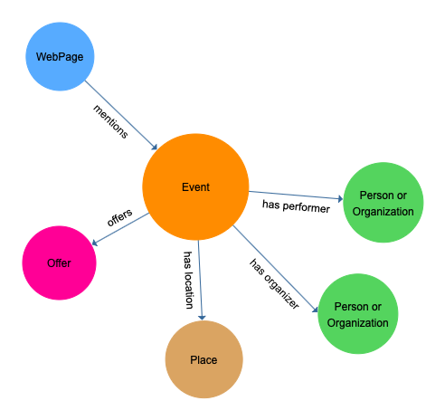

## Artsdata Data Model v{{ site.data.versions.schemaVersion}}

A simple data model for Performing Arts Events and related Places, People and Organizations. 

Here are the main Classes used in the date we collect.

[[open drawing tool](https://www.yworks.com/yed-live/?file=https://gist.githubusercontent.com/saumier/c1d9b2a3392a1e03c8a14d9fbc2ac5d6/raw/8113c090a24e81c86c64d7a9425b865032a51517/artsdata_event_model)]

### Classes

<ol>

<li>
    <a href="{{ class.url }}">
        {{ class.class_name }}
    </a>
</li>

</ol>

### Support or Contact

[Contact support](mailto:support@culturecreates.com) and we’ll help you sort it out.
